# Sistema de Gestão Universitária

## Integrantes do Grupo

- Adriano Basílio Júnior
- Ana Letícia Carvalho Couras
- Andréia Goveia da Costa
- Erick Felipe dos Santos de Melo
- Gabriel Alves Marques
- Raniere Marinho de Lira
- Thiago Dourado de Carvalho

---

## Protótipos de Interface - Figma

Nesta seção estão apresentados os protótipos das principais jornadas do sistema, desenvolvidos conforme os diagramas de caso de uso da primeira etapa. Cada protótipo foi criado no Figma e representa a interface para as funcionalidades principais do sistema.

### Tela Inicial

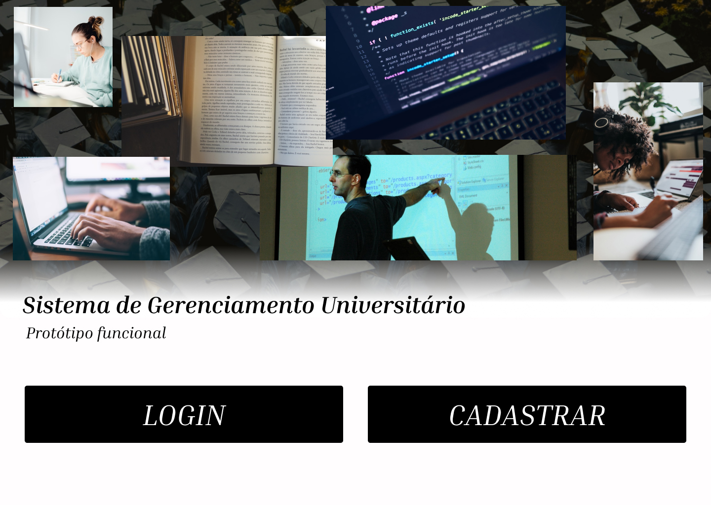
Protótipo da tela inicial do sistema, apresentando as principais opções de navegação.

### Tela de Cadastro geral

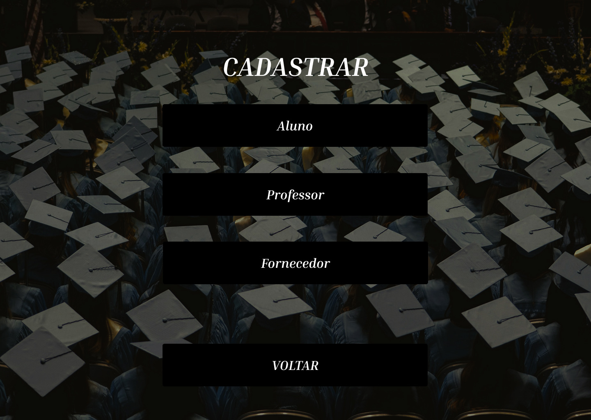
Protótipo da tela de cadastro, permitindo o registro de dados pessoais de Aluno, Professor ou Fornecedor.

### Cadastro de Alunos

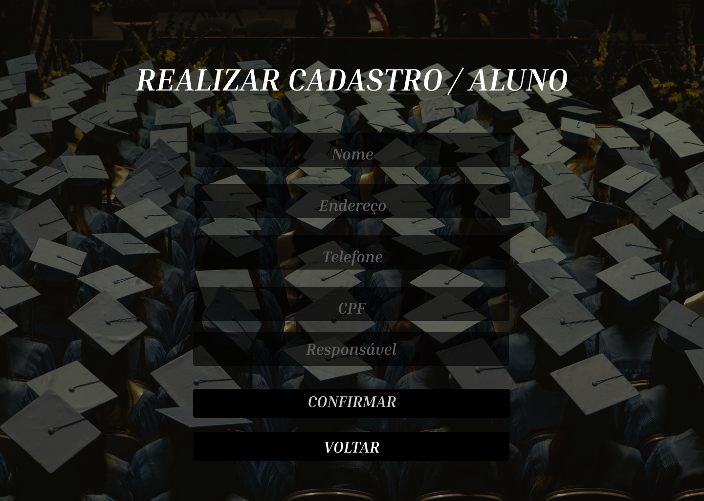
Protótipo da tela de cadastro de alunos.

### Cadastro de Professores

Protótipo da tela de cadastro de professores, com campos específicos para dados acadêmicos.

### Cadastro de Fornecedores

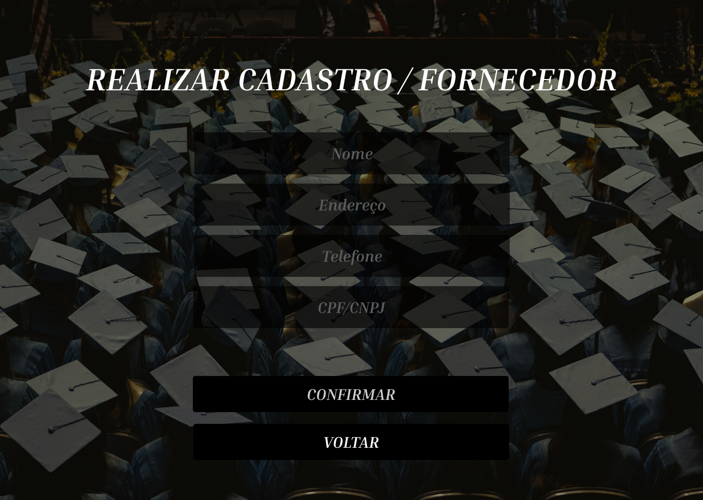
Protótipo da tela de cadastro de pessoa jurídica, voltada para fornecedores.

### Tela de *Login*

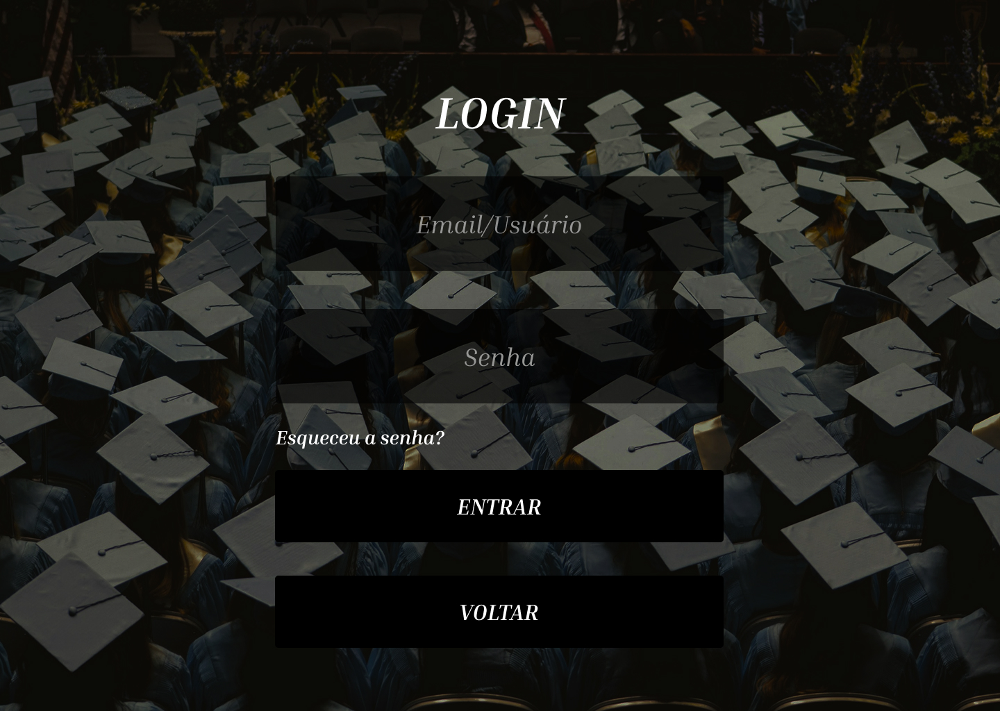
Protótipo da tela de *login* do sistema.

### Consultar Dados

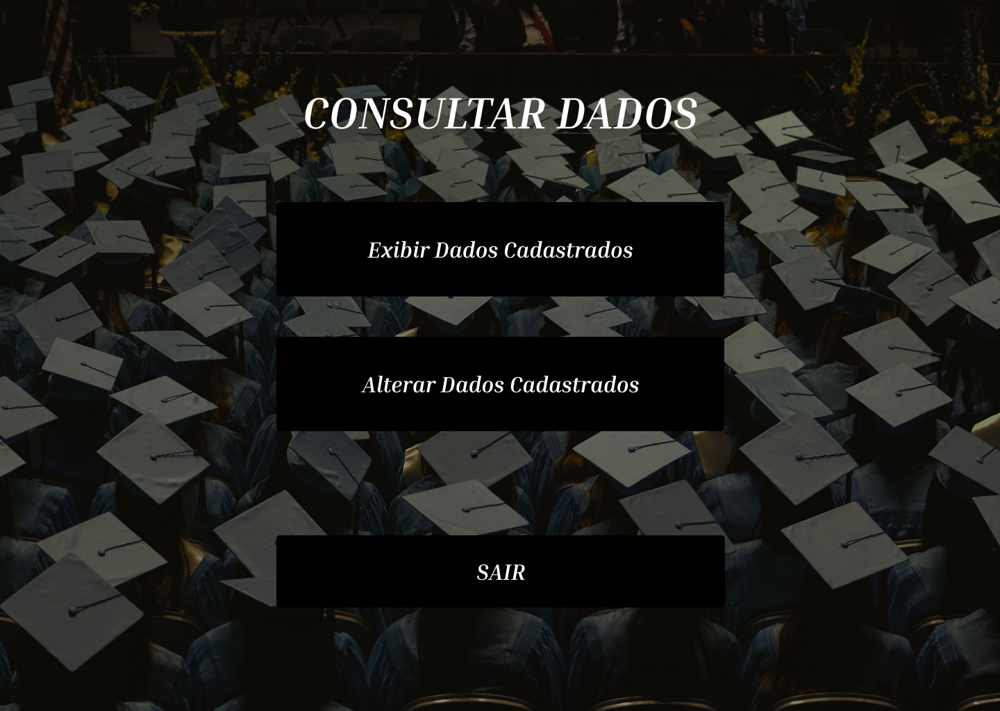
Protótipo da tela de consulta de dados.

### Alterar Dados

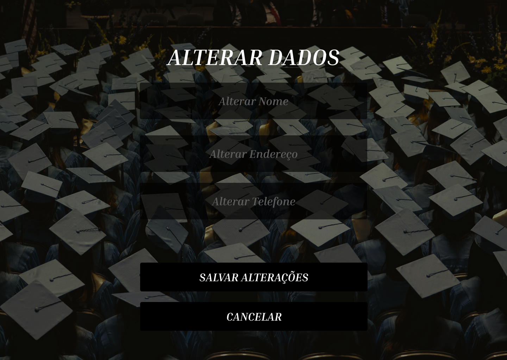
Protótipo da tela de alteração de dados.

### Exibir Dados

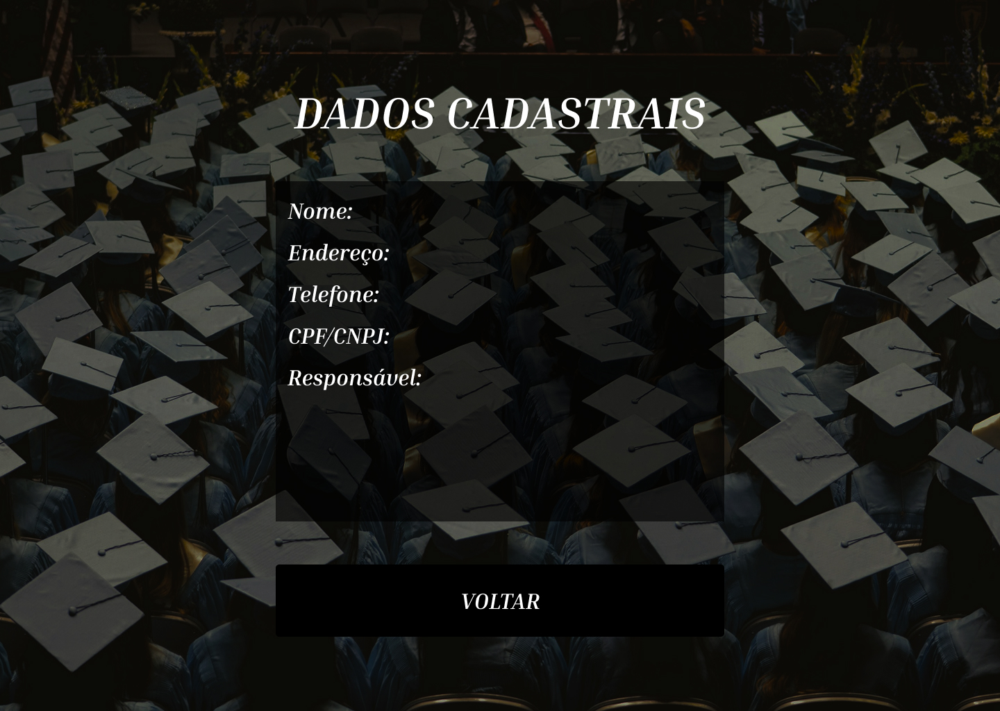
Protótipo da tela de dados cadastrais do usuário.

### Recuperar Senha

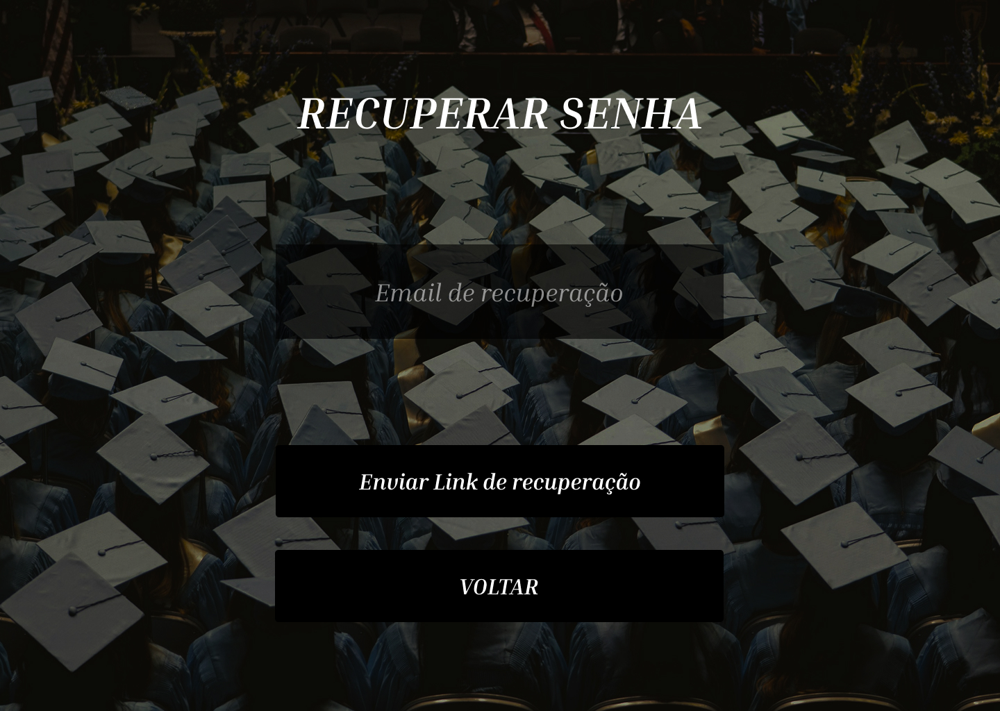
Protótipo da tela de recuperação de senha, solicitando email de recuperação.

### Link de Recuperação

Protótipo da tela de confirmação do envio do link de recuperação de senha.

---

### Documentação dos diagramas criados na etapa 1

---

## Introdução

A **UML (Unified Modeling Language)** é uma linguagem de modelagem visual padrão, amplamente usada na área de engenharia de software para especificar, visualizar, construir e documentar sistemas de softwares.

Este projeto apresenta uma situação fictícia de uma universidade onde há necessidade de um sistema de cadastro, formulando-se assim um caso de uso para representar a mesma, os atores, sistema e metas.

---

## 1. Diagrama de Casos de Uso

O diagrama abaixo representa todos os casos de uso do sistema de gestão universitária:

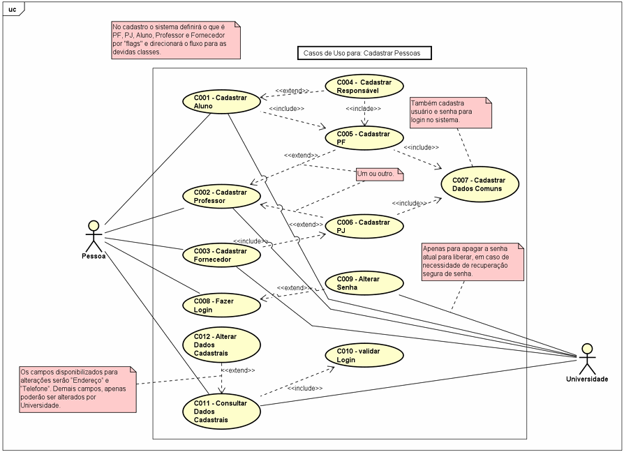

---

## 2. Especificação dos Casos de Uso

### C001 - Cadastrar Aluno

| **Item**                  | **Descrição**                                                           |
| ------------------------- | ----------------------------------------------------------------------- |
| **Atores**                | Universidade, Aluno                                                     |
| **Pré-Condição**          | Usuário clica em "Cadastrar Usuário" na janela inicial                  |
| **Cenário Principal**     | Usuário marca a opção "Aluno" e realiza o cadastro                      |
| **Cenário Alternativo 1** | Campo Telefone vazio: sistema informa e não permite avançar no cadastro |
| **Cenário Alternativo 2** | Campo Endereço vazio: sistema informa e não permite avançar no cadastro |
| **Pós-Condição**          | Sistema informa sucesso e redireciona para janela de login              |

### C002 - Cadastrar Professor

| **Item**                  | **Descrição**                                                              |
| ------------------------- | -------------------------------------------------------------------------- |
| **Atores**                | Universidade, Professor                                                    |
| **Pré-Condição**          | Usuário clica em "Cadastrar Usuário" na janela inicial                     |
| **Cenário Principal**     | Usuário clica em "Professor - PF" ou "Professor - PJ" e realiza o cadastro |
| **Cenário Alternativo 1** | Campo Telefone vazio: sistema informa e não permite avançar no cadastro    |
| **Cenário Alternativo 2** | Campo Endereço vazio: sistema informa e não permite avançar no cadastro    |
| **Pós-Condição**          | Sistema informa sucesso e redireciona para janela de login                 |

### C003 - Cadastrar Fornecedor

| **Item**                  | **Descrição**                                                           |
| ------------------------- | ----------------------------------------------------------------------- |
| **Atores**                | Universidade, Fornecedor                                                |
| **Pré-Condição**          | Usuário clica em "Cadastrar Usuário" na janela inicial                  |
| **Cenário Principal**     | Usuário clica em "Fornecedor" e realiza o cadastro                      |
| **Cenário Alternativo 1** | Campo Nome vazio: sistema informa e não permite avançar no cadastro     |
| **Cenário Alternativo 2** | Campo Endereço vazio: sistema informa e não permite avançar no cadastro |
| **Pós-Condição**          | Sistema informa sucesso e redireciona para janela de login              |

### C004 - Cadastrar Responsável

| **Item**                  | **Descrição**                                                                                        |
| ------------------------- | ---------------------------------------------------------------------------------------------------- |
| **Atores**                | Universidade, Aluno                                                                                  |
| **Pré-Condição**          | Usuário clica em "Cadastrar Usuário" na janela inicial                                               |
| **Cenário Principal**     | Na janela de cadastro de usuário, o usuário marca a opção "Aluno" e clica em "Cadastrar Responsável" |
| **Cenário Alternativo 1** | Campo Telefone vazio: sistema informa e não permite avançar no cadastro                              |
| **Cenário Alternativo 2** | Campo Endereço vazio: sistema informa e não permite avançar no cadastro                              |
| **Pós-Condição**          | Sistema informa sucesso e redireciona para janela de cadastro de aluno                               |

### C005 - Cadastrar PF

| **Item**                  | **Descrição**                                                                                                                           |
| ------------------------- | --------------------------------------------------------------------------------------------------------------------------------------- |
| **Atores**                | Universidade, Aluno, Professor                                                                                                          |
| **Pré-Condição**          | Usuário clica em "Cadastrar Usuário" na janela inicial                                                                                  |
| **Cenário Principal**     | Recebe dados do usuário e os envia para o banco de dados                                                                                |
| **Cenário Alternativo 1** | CPF inválido: sistema informa e não permite avançar no cadastro                                                                         |
| **Cenário Alternativo 2** | CPF já registrado: sistema informa e não permite avançar                                                                                |
| **Pós-Condição**          | Sistema informa sucesso e redireciona para janela de login (se for cadastro de responsável, retorna para a janela de cadastro de aluno) |

### C006 - Cadastrar PJ

| **Item**                  | **Descrição**                                                          |
| ------------------------- | ---------------------------------------------------------------------- |
| **Atores**                | Universidade, Fornecedor, Professor                                    |
| **Pré-Condição**          | Usuário acessa o sistema e clica em "Cadastrar Usuário"                |
| **Cenário Principal**     | Recebe dados do usuário e os envia para o banco de dados               |
| **Cenário Alternativo 1** | CNPJ inválido: sistema informa e não permite avançar no cadastro       |
| **Cenário Alternativo 2** | CNPJ já cadastrado: sistema informa e redireciona para janela de login |
| **Pós-Condição**          | Os dados são armazenados no banco de dados                             |

### C007 - Cadastrar Dados Comuns

| **Item**                  | **Descrição**                                                                              |
| ------------------------- | ------------------------------------------------------------------------------------------ |
| **Atores**                | Universidade, Fornecedor, Professor, Aluno                                                 |
| **Pré-Condição**          | Usuário acessa o sistema e clica em "Cadastrar Usuário"                                    |
| **Cenário Principal**     | Recebe dados de usuário e os envia para o banco de dados. Cadastra nome de usuário e senha |
| **Cenário Alternativo 1** | Campo Endereço vazio: sistema informa e não permite avançar                                |
| **Cenário Alternativo 2** | Campo Telefone vazio: sistema informa e não permite avançar                                |
| **Pós-Condição**          | Os dados são armazenados no banco de dados                                                 |

### C008 - Fazer Login

| **Item**                  | **Descrição**                                                                     |
| ------------------------- | --------------------------------------------------------------------------------- |
| **Atores**                | Aluno, Professor, Fornecedor                                                      |
| **Pré-Condição**          | O usuário deve estar cadastrado no sistema                                        |
| **Cenário Principal**     | Usuário acessa janela inicial e clica em "Login". Digita usuário e senha          |
| **Cenário Alternativo 1** | Senha ou nome incorreto: sistema informa e não permite avançar                    |
| **Cenário Alternativo 2** | Usuário clica em "Esqueci a senha": sistema redireciona para recuperação de senha |
| **Pós-Condição**          | Exibe a janela inicial do aplicativo                                              |

### C009 - Alterar Senha

| **Item**                  | **Descrição**                                                                                        |
| ------------------------- | ---------------------------------------------------------------------------------------------------- |
| **Atores**                | Aluno, Professor, Fornecedor                                                                         |
| **Pré-Condição**          | O usuário deve estar logado no sistema                                                               |
| **Cenário Principal**     | Usuário acessa janela de login e clica em "Alterar Senha". Sistema solicita senha atual e nova senha |
| **Cenário Alternativo 1** | Nova senha não atinge exigências mínimas: sistema informa e impede continuação                       |
| **Cenário Alternativo 2** | Nova senha igual à anterior: sistema informa e impede continuação                                    |
| **Pós-Condição**          | Sistema redireciona para janela anterior                                                             |

### C010 - Validar Login

| **Item**                  | **Descrição**                                                                               |
| ------------------------- | ------------------------------------------------------------------------------------------- |
| **Ator**                  | Sistema                                                                                     |
| **Pré-Condição**          | Nome de usuário e senha já digitados na janela de login                                     |
| **Cenário Principal**     | Classe recebe informações de login, verifica no banco de dados, criptografa senha e compara |
| **Cenário Alternativo 1** | Nome de usuário não localizado: função retorna "false"                                      |
| **Cenário Alternativo 2** | Senha difere da registrada: função retorna "false"                                          |
| **Pós-Condição**          | A função de validação retorna "true"                                                        |

### C011 - Consultar Dados Cadastrais

| **Item**                  | **Descrição**                                                                            |
| ------------------------- | ---------------------------------------------------------------------------------------- |
| **Atores**                | Universidade, Aluno, Professor, Fornecedor                                               |
| **Pré-Condição**          | O usuário deve estar logado no sistema                                                   |
| **Cenário Principal**     | Usuário clica em "Consultar Dados Cadastrais". Sistema abre janela com dados cadastrados |
| **Cenário Alternativo 1** | Usuário não logado: sistema informa e direciona para login                               |
| **Cenário Alternativo 2** | Universidade busca dados de pessoa não cadastrada: sistema informa e permanece na janela |
| **Pós-Condição**          | Dados do cadastro são exibidos em tela                                                   |

### C012 - Alterar Dados Cadastrais

| **Item**                  | **Descrição**                                                  |
| ------------------------- | -------------------------------------------------------------- |
| **Atores**                | Universidade, Aluno, Professor, Fornecedor                     |
| **Pré-Condição**          | Usuário deve estar logado no sistema                           |
| **Cenário Principal**     | Usuário clica em "Alterar" na janela "Exibir Dados Cadastrais" |
| **Cenário Alternativo 1** | Campo Endereço vazio: sistema informa e não permite avançar    |
| **Cenário Alternativo 2** | Campo Telefone vazio: sistema informa e não permite avançar    |
| **Pós-Condição**          | Sistema retorna para janela "Exibir Dados Cadastrais"          |

---

## 3. Diagrama de Classes

O diagrama de classes apresenta a estrutura estática do sistema:

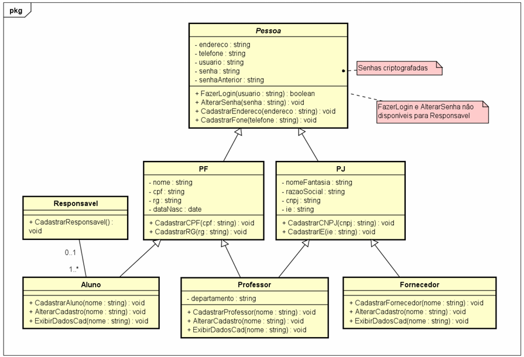

---

## Conclusão

Utilizamos a modelagem orientada a objetos usando a linguagem UML (Unified Modeling Language) para representar um sistema de gestão de dados de uma universidade. Através dos diagramas e cenários desenvolvidos, é possível notar a importância da modelagem visual na compreensão e planejamento de sistemas de software.

Realizamos o cadastro de diferentes tipos de pessoas que interagem com o sistema, como alunos, professores e fornecedores, diferenciando-os entre pessoas físicas e jurídicas. Elaboramos cenários completos de casos de uso, incluindo o cenário principal e os cenários alternativos, descrevendo pré-condições e pós-condições, abordando de forma clara o comportamento esperado do sistema criado em diferentes situações, como no cadastro, login, alteração de senha, consulta de dados cadastrais etc.

Dessa forma, cumprimos todos os requisitos propostos pelo Projeto Integrador e vimos como a modelagem UML pode ajudar na organização e documentação de um sistema complexo antes mesmo do desenvolvimento de qualquer código.

---

## Referências

1. OLIVEIRA, Henrique Pontes Gonçalves de. _Análise de sistemas_. São Paulo: Senac São Paulo, 2019.
2. PESSÔA FILHO, Joaquim. _Programação orientada a objetos com C#_. São Paulo: Senac São Paulo, 2023.
3. LUCID SOFTWARE PORTUGUÊS. Tutorial de Caso de Uso UML. YouTube, 22 maio 2025. Disponível em: [https://youtu.be/ab6eDdwS3rA](https://youtu.be/ab6eDdwS3rA). Acesso em: 22 maio 2025.
4. MAZER DV – ADEMIR MAZER JUNIOR. UML – Descrição de Casos de Uso – teoria. YouTube, 22 maio 2025. Disponível em: [https://youtu.be/UFR0ZkYIefk](https://youtu.be/UFR0ZkYIefk). Acesso em: 22 maio 2025.
5. PROFESSOR CLAUDIO SANAVRIA. #11 – Modelagem de Sistemas (4) – Descrição de Casos de Uso. YouTube, 28 maio 2025. Disponível em: [https://youtu.be/Dhjgd8kUUNY](https://youtu.be/Dhjgd8kUUNY). Acesso em: 28 maio 2025.
6. **Markdown Guide**. Disponível em: [https://www.markdownguide.org/basic-syntax/](https://www.markdownguide.org/basic-syntax/)
